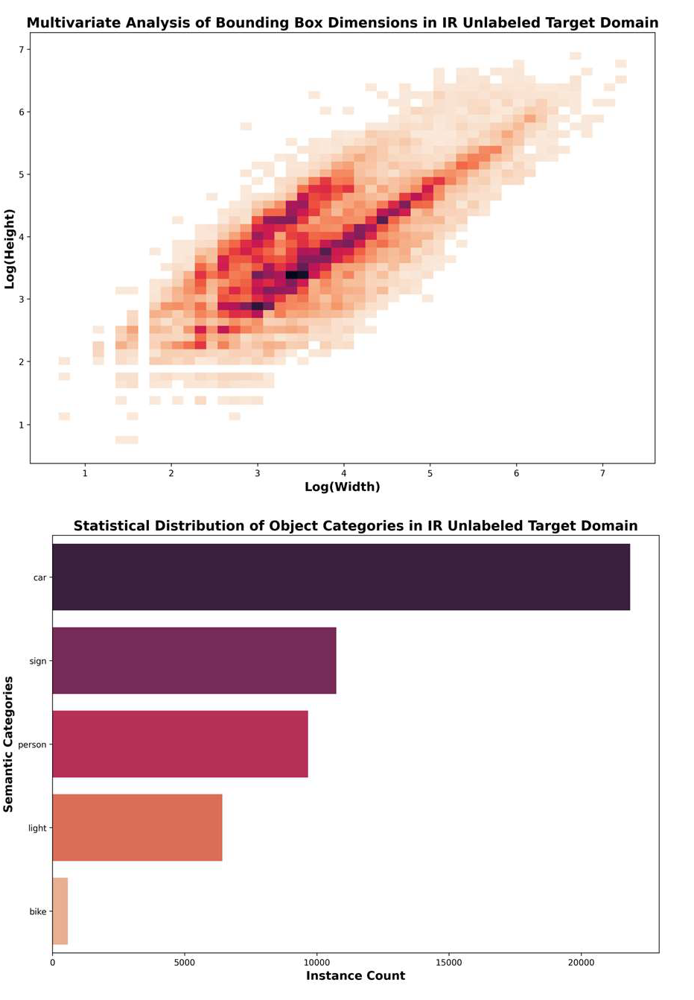
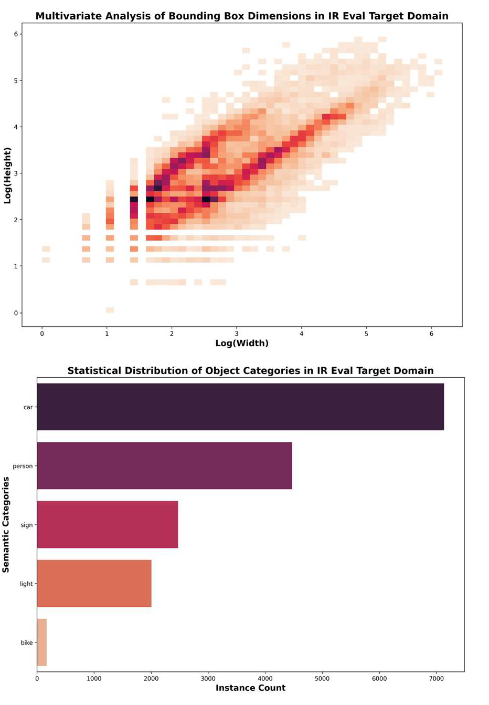
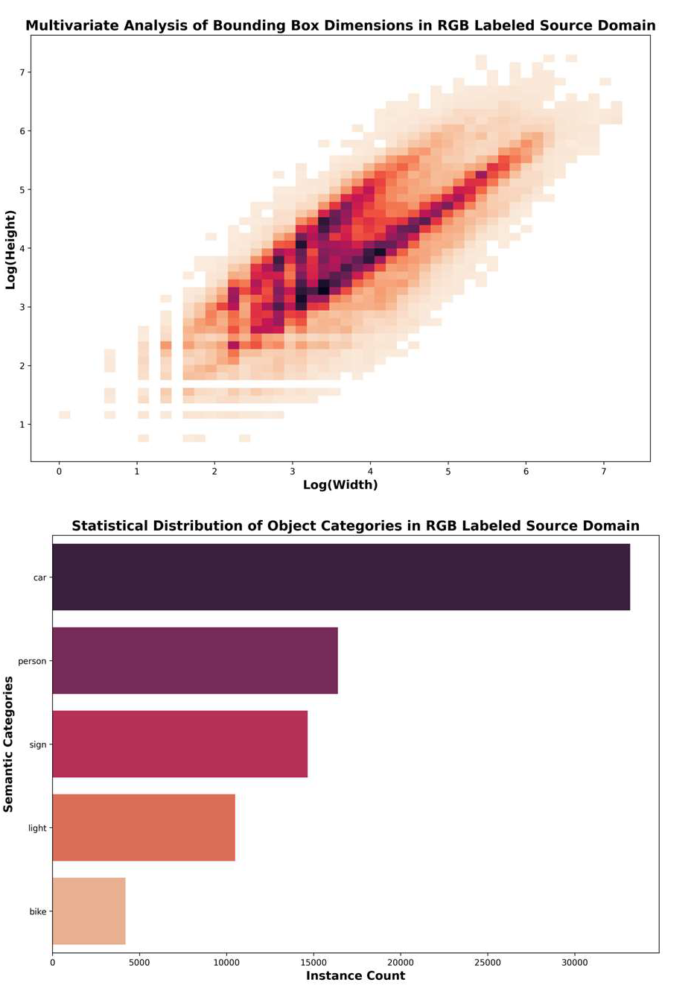
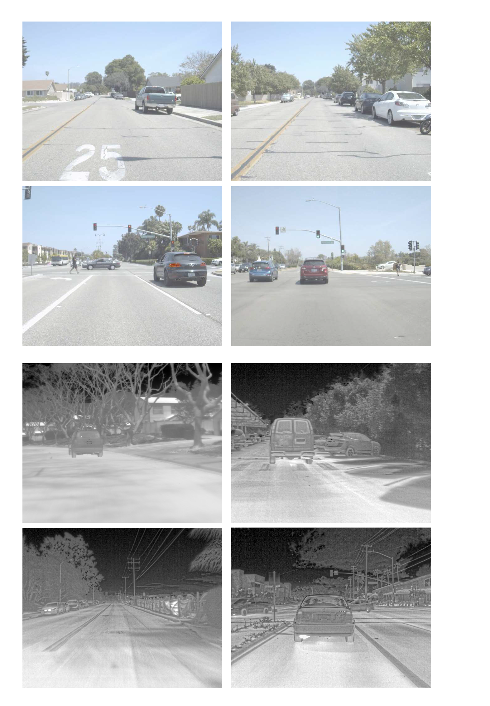

# FLIR-ADAS Evaluation Protocol for RGB→IR Domain Adaptive Object Detection

[](https://creativecommons.org/licenses/by-nc/4.0/)
[]()

[中文版本](#flir-adas-rgbir域自适应目标检测评测协议-中文)

---

## Overview

This repository provides the **FLIR-ADAS Evaluation Protocol** specifically designed for **Unsupervised Domain Adaptive Object Detection (UDAOD)** from **RGB (Visible)** to **IR (Infrared)** domains.

Built upon the FLIR-ADAS dataset, this protocol addresses the unique challenges of visible-to-thermal domain adaptation by introducing independent annotations, diverse source domains, and weak alignment mitigation strategies.

## Dataset Statistics

The evaluation protocol consists of three mutually exclusive subsets:

| Subset | Modality | Annotation | Images | Purpose |
|--------|----------|------------|--------|---------|
| Source Train | RGB (Visible) | With bounding box labels | **5,663** | Supervised training (Burn-in & source term) |
| Target Train | IR (Infrared) | Unlabeled | **4,856** | Pseudo-label generation & consistency learning |
| Target Eval | IR (Infrared) | With bounding box labels | **1,144** | Performance evaluation |

**Total**: ~10,000 images across RGB and IR modalities

## Key Features

### 1. Independent Annotations

Unlike fusion-oriented datasets with paired shared annotations, our protocol employs **independently annotated** RGB and IR images. This design:

- Eliminates annotation mismatch between modalities
- Prevents information leakage in domain adaptation evaluation
- Aligns with the true UDAOD setting (source: labeled RGB, target: unlabeled IR)

### 2. Diverse Source Domain

The RGB training set explicitly covers multiple scenarios:

- **Daytime** scenes with normal lighting
- **Nighttime** scenes with low illumination
- **Glare** scenes with challenging lighting conditions

This diversity enables algorithms to leverage intra-domain variations for better cross-domain generalization.

### 3. Weak Alignment Mitigation

To ensure rigorous evaluation:

- Scene-level matching is performed to identify paired RGB-IR sequences
- For each scene, one modality is randomly dropped to prevent same-scene pairing
- This eliminates weak alignment issues and ensures no information leakage between training sets

### 4. Object Categories

The protocol focuses on the following categories relevant to autonomous driving:

- **Person** (Pedestrian)
- **Bicycle**
- **Car**
- **Sign** (Traffic signs)
- **Light** (Traffic lights)

## Dataset Visualization

### Dataset Distribution Statistics

Below are the distribution statistics for each subset of our protocol:

#### IR Unlabeled Training Set Distribution



*Figure 1: Distribution statistics of the IR unlabeled training dataset across different object categories.*

#### IR Evaluation Set Distribution



*Figure 2: Distribution statistics of the IR evaluation dataset across different object categories.*

#### RGB Labeled Training Set Distribution



*Figure 3: Distribution statistics of the RGB labeled training dataset across different object categories.*

### Comparison with Previous Protocols

#### FLIR-ALIGN Dataset Examples



*Figure 4: Examples from the FLIR dataset showing paired RGB and IR images with shared annotations. This dataset was originally designed for fusion tasks.*

#### FLIR-ADAS Dataset Examples (Our Protocol)


*Figure 5: Examples from our FLIR-ADAS protocol showing independently annotated RGB (including daytime, nighttime, and glare scenes) and IR images. The diverse scenarios better reflect real-world distribution.*

## Download

### Baidu Netdisk (百度网盘)

**Archive**: `FLIR_ADAS_UDAOD_coco.zip`

**Link**: [https://pan.baidu.com/s/1fdtAJbxNEjP9j_GsCR5OmQ](https://pan.baidu.com/s/1fdtAJbxNEjP9j_GsCR5OmQ?pwd=FLIR)

**Extraction code / 提取码**: `FLIR`

*(The link above includes the password parameter; entering `FLIR` when prompted should also work.)*

> **Note**: If the link expires or you cannot access the files, please contact us by email (see below).

### Alternative Access

If the download link is unavailable, please send an email to:

📧 **a18736522195@163.com**

Subject format: `[FLIR-ADAS Protocol] Dataset Request - [Your Institution]`

Please include:

- Your name and affiliation
- Purpose of use (research / education)
- Agreement to terms of use

## Dataset Structure

```
FLIR-ADAS-Protocol/
├── source_train/
│   ├── images/           # 5,663 RGB images
│   └── annotations/      # COCO-format JSON labels
├── target_train/
│   └── images/           # 4,856 IR images (unlabeled)
├── target_eval/
│   ├── images/           # 1,144 IR images
│   └── annotations/      # COCO-format JSON labels
├── splits/               # Train/val split files
├── appendix_v1_crop_1.png    # visualization: IR train distribution (optional root folder)
├── appendix_v1_crop_2.png    # visualization: IR eval distribution
├── appendix_v1_crop_3.png    # visualization: RGB train distribution
├── appendix_v1_crop_4.png    # visualization: FLIR examples
├── appendix_v1_crop_5.png    # visualization: FLIR-ADAS examples
└── README.md
```

Place the five figure files in the **same folder as this README** (repository root recommended) so the image links resolve correctly.

## Benchmark Results

Our protocol has been validated with state-of-the-art UDAOD methods. Key results (mAP@COCO):

| Method | Backbone | Person | Bicycle | Car | Sign | Light | mAP |
|--------|----------|--------|---------|-----|------|-------|-----|
| Source Only | ResNet-50 | 39.32 | 32.53 | 57.97 | 20.05 | 9.20 | 31.81 |
| Semi-DETR | ResNet-50 | 51.40 | 36.83 | 70.68 | 32.12 | 15.24 | 41.25 |
| DATR | ResNet-50 | 52.38 | 38.13 | 69.59 | 32.84 | 16.94 | 41.98 |
| D3T | ResNet-50 | 52.75 | 41.87 | 71.78 | 30.99 | 17.80 | 43.04 |
| **SS-DC (Ours)** | ResNet-50 | **56.36** | **41.58** | **75.82** | **39.83** | **26.51** | **48.02** |

For detailed experimental settings, please refer to our paper.

## Citation

If you use this dataset or protocol in your research, please cite:

```bibtex
@inproceedings{ssdr2025,
  title={SS-DC: Spatial-Spectral Decoupling and Coupling Across RGB-Thermal Gap for Domain Adaptive Object Detection},
  author={Anonymous},
  booktitle={Proceedings of the IEEE/CVF International Conference on Computer Vision (ICCV)},
  year={2025}
}
```

## Terms of Use

This dataset is released for **research and educational purposes only**.

- The dataset is based on FLIR-ADAS. Please also respect the original dataset's terms of use.
- Do not use this dataset for commercial purposes without permission.
- When publishing results using this protocol, please cite both this work and the original FLIR-ADAS dataset.

## Contact

For questions, issues, or collaboration inquiries:

📧 **a18736522195@163.com**

---

# FLIR-ADAS RGB→IR域自适应目标检测评测协议（中文）

## 概述

本仓库提供专门用于**可见光（RGB）到红外（IR）无监督域自适应目标检测（UDAOD）**的 **FLIR-ADAS 评测协议**。

该协议基于 FLIR-ADAS 数据集构建，通过引入独立标注、多样化源域和弱对齐缓解策略，应对可见光—热红外域自适应的挑战。

## 数据集统计

| 子集 | 模态 | 标注情况 | 图像数量 | 用途 |
|------|------|----------|----------|------|
| 源域训练集 | 可见光 | 有检测框标注 | **5,663** | 监督训练（Burn-in 及源域项） |
| 目标域训练集 | 红外 | 无标注 | **4,856** | 教师伪标签、学生一致性学习 |
| 目标域评估集 | 红外 | 有检测框标注 | **1,144** | 性能评测 |

**总计**：约 10,000 张可见光与红外模态图像

## 核心特点

### 1. 独立标注

与成对共享标注的融合数据集不同，本协议采用**独立标注**的可见光与红外图像，有利于避免模态间标注不一致、规避评估中的信息泄露，并与 UDAOD 设定一致（源域有标注可见光、目标域无标注红外）。

### 2. 多样化源域

可见光训练集覆盖**白天**、**夜间**、**眩光**等多样条件，便于利用源域内分布差异辅助跨域泛化。

### 3. 弱对齐缓解

通过场景配对与单侧舍弃等策略缓解弱对齐与同场景泄漏问题，详见正文与附图说明。

### 4. 目标类别

聚焦于行人、自行车、汽车、交通标志与交通信号灯等与自动驾驶相关的类别。

## 数据集可视化

### 数据集分布统计

#### 红外无标注训练集分布


*图 1：红外无标注训练集各类别分布统计。*

#### 红外评估集分布


*图 2：红外评估集各类别分布统计。*

#### 可见光有标注训练集分布


*图 3：可见光有标注训练集各类别分布统计。*

### 与其它设定对比图示

#### FLIR 数据集示例


*图 4：FLIR 数据中配对的 RGB 与红外示例（融合检测任务常用设定）。*

#### FLIR-ADAS 数据集示例（本协议）


*图 5：本协议中独立标注的可见光（含白天、夜间、眩光等）与红外示例。*

**说明**：请将 `appendix_v1_crop_1.png`～`appendix_v1_crop_5.png` 与本 `README.md` 放在同一目录（或仓库根目录），以便图片正常显示。

## 下载方式

### 百度网盘

**压缩包文件名**：`FLIR_ADAS_UDAOD_coco.zip`

**链接**：[https://pan.baidu.com/s/1fdtAJbxNEjP9j_GsCR5OmQ](https://pan.baidu.com/s/1fdtAJbxNEjP9j_GsCR5OmQ?pwd=FLIR)

**提取码**：`FLIR`

*(链接已带 `pwd` 参数；若需手动输入，提取码亦为 `FLIR`。)*

> 若链接失效或无法下载，请发邮件联系下方邮箱。

### 备用联系

📧 **a18736522195@163.com**

邮件主题示例：`[FLIR-ADAS Protocol] 数据集申请 - [单位或个人]`

并请说明用途（研究 / 教学）及同意遵守使用条款。

## 数据集目录结构（说明）

```
FLIR-ADAS-Protocol/
├── source_train/          # 可见光源域训练
├── target_train/          # 红外目标域训练（无标）
├── target_eval/           # 红外评估（有标）
├── splits/
├── appendix_v1_crop_1.png … appendix_v1_crop_5.png  # 与本 README 同目录
└── dataset_README.md      # 本文件（或可重命名为 README.md）
```

## 基准结果（节选）

| 方法 | 骨干 | Person | Bicycle | Car | Sign | Light | mAP |
|------|------|--------|---------|-----|------|-------|-----|
| Source Only | ResNet-50 | 39.32 | 32.53 | 57.97 | 20.05 | 9.20 | 31.81 |
| Semi-DETR | ResNet-50 | 51.40 | 36.83 | 70.68 | 32.12 | 15.24 | 41.25 |
| DATR | ResNet-50 | 52.38 | 38.13 | 69.59 | 32.84 | 16.94 | 41.98 |
| D3T | ResNet-50 | 52.75 | 41.87 | 71.78 | 30.99 | 17.80 | 43.04 |
| **SS-DC（本文）** | ResNet-50 | **56.36** | **41.58** | **75.82** | **39.83** | **26.51** | **48.02** |

## 引用

若使用本协议或数据，请注明论文与原始 FLIR-ADAS 数据源，例如：

```bibtex
@inproceedings{ssdr2025,
  title={SS-DC: Spatial-Spectral Decoupling and Coupling Across RGB-Thermal Gap for Domain Adaptive Object Detection},
  author={Anonymous},
  booktitle={Proceedings of the IEEE/CVF International Conference on Computer Vision (ICCV)},
  year={2025}
}
```

## 使用条款

仅供**研究与教学**用途；商业使用须另行授权。使用本评测协议时请同时遵守 **FLIR-ADAS** 原始数据集的许可约定。

## 致谢

评测协议建立在 **FLIR-ADAS** 数据基础之上，感谢原始数据提供方对 RGB-IR 研究的支撑。

## 联系我们

📧 **a18736522195@163.com**
